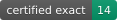

<p align="center">
  
</p>

# qLDPC Challenge





A public, automatically verified leaderboard for quantum low-density
parity-check (qLDPC) codes. Submit a code, the verifier checks it, and if it
holds up it goes on the board.

The leaderboard site is generated into `docs/` by `site/build.py` (run `uv run
python site/build.py`); open `docs/index.html` to view it.

The badges above are regenerated on every build from the live board data
(`docs/stats.json`), so they track the current numbers rather than a hand-typed
count.

Unlike a single-number competition, a quantum code trades several quantities
against each other (physical qubits n, logical qubits k, distance d, check
weight, geometric locality) and separately has a decoding performance. So the
boards are stratified into tracks, and within a track the ranking is a Pareto
frontier rather than one winner. See `TRACKS.md`.

## Submitting

A submission is one JSON file in `codes/`, following `schema/code.schema.json`
(explained in `schema/SCHEMA.md`). Open a pull request adding it. CI runs the
verifier; a green check means the code's cheap, trustless properties are
confirmed:

- `n`, `k` (recomputed exactly over GF(2)), CSS commutation, max check weight,
  and geometric locality against your stated layout, all machine-checked.
- The distance you claim must come with a witness: an explicit logical
  operator of that weight. The verifier confirms it is a genuine nontrivial
  logical, which certifies the distance as an upper bound with no trust
  required.

Claiming a distance is exact (not just an upper bound) additionally requires
server certification, a separate and more expensive step.

Verify locally before opening a PR (uv handles the environment):

```
uv run python verify/qldpc_verify.py codes/your-code.json
```

The [qLDPC library](https://github.com/qLDPCOrg/qLDPC) is a convenient way to
construct codes and export the parity checks a submission needs.

## Layout

```
schema/    the submission format (JSON Schema + human spec)
verify/    the verifier (gf2.py is the GF(2) core; qldpc_verify.py is the checker)
examples/  worked examples that pass verification
codes/     accepted submissions (the leaderboard data)
certs/     server-side exact-distance certificates, one per certified code
decode/    decoding-track evaluator (BP+OSD code-capacity LER) + leaderboard data
site/      build.py, which generates the static site into docs/
docs/      the generated site (index, per-code pages, references, badges)
refs.bib   bibliography; references.html is generated from it
TRACKS.md  the tracks and how ranking works
```

The boards are seeded with the codes of Liang, Eberhardt, Chen
(arXiv:2504.08887) as the reference baseline.
